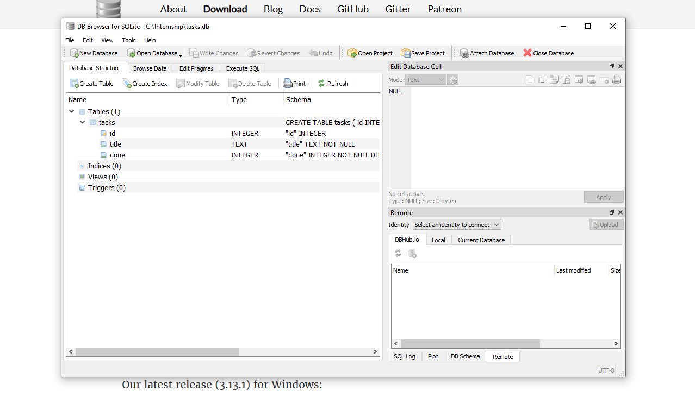

# Task API

A simple CRUD API built with FastAPI and SQLite.

## Features

- Create a task
- Get all tasks
- Get a task by ID
- Update a task
- Delete a task
- Store task data in SQLite
- Data remains after server restart
- Swagger UI for testing API

## Tech Stack

- Python
- FastAPI
- SQLite
- Uvicorn
- Pydantic

## Run the project

Install dependencies:

```bash
pip install fastapi uvicorn
```

Run the server:

```bash
uvicorn main:app --reload
```

Open Swagger UI:

```text
http://127.0.0.1:8000/docs
```

## API Endpoints

| Method | Endpoint | Description |
|---|---|---|
| GET | `/tasks` | Get all tasks |
| GET | `/tasks/{task_id}` | Get a task by ID |
| POST | `/tasks` | Create a new task |
| PUT | `/tasks/{task_id}` | Update a task |
| DELETE | `/tasks/{task_id}` | Delete a task |

## SQLite

This project uses SQLite because it is simple, lightweight, and does not require a separate database server.

The database is stored in:

```text
tasks.db
```

The database and the `tasks` table are created automatically when the application starts.

Task data is stored in the database, so it is still available after restarting the server.

## SQL Queries

I used DB Browser for SQLite to run SQL queries directly.

Get all tasks:

```sql
SELECT * FROM tasks;
```

Get completed tasks:

```sql
SELECT * FROM tasks WHERE done = 1;
```

Count all tasks:

```sql
SELECT COUNT(*) FROM tasks;
```

Mark all tasks as completed:

```sql
UPDATE tasks SET done = 1;
```

Delete completed tasks:

```sql
DELETE FROM tasks WHERE done = 1;
```

Example:

```sql
SELECT COUNT(*) FROM tasks;
```

This query returns the total number of tasks in the database.

Changes made directly in DB Browser can also be seen through `GET /tasks` because the API and DB Browser use the same `tasks.db` file.

## Database Screenshot

Add a screenshot of `tasks.db` opened in DB Browser here:

```markdown

```